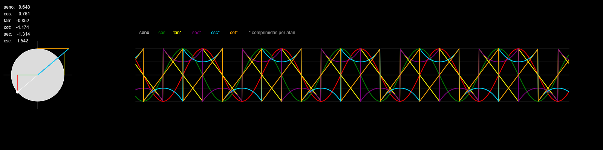

# Visualização Matemática de Funções Trigonométricas com p5.js

Este projeto é uma **representação interativa do círculo trigonométrico e de suas funções derivadas**: seno, cosseno, tangente, cotangente, secante e cosecante. O objetivo é mostrar, de forma visual e dinâmica, a relação entre **geometria do círculo** e **valores das funções trigonométricas**.



## O Círculo Trigonométrico

- O ponto percorre um círculo de raio `r`.  
- O **cateto horizontal** é o **cosseno**: `x = r * cos(θ)`.  
- O **cateto vertical** é o **seno**: `y = r * sin(θ)`.  
- A hipotenusa é o próprio raio `r`.

Este triângulo retângulo permite visualizar as **razões trigonométricas básicas** para qualquer ângulo θ.

## Funções Derivadas e Construções Geométricas

### Tangente e Secante

- Tangente: `tan(θ) = seno / cosseno`. Representada como segmento vertical que intercepta a tangente ao círculo.  
- Secante: `sec(θ) = 1 / coseno`. Representada como linha do centro do círculo até o ponto da tangente vertical.  

Singularidades ocorrem quando `coseno = 0`, e nesse caso a tangente tende a ±∞.

### Cotangente e Cosecante

- Cotangente: `cot(θ) = cosseno / seno`. Linha horizontal tangente ao topo do círculo.  
- Cosecante: `csc(θ) = 1 / seno`. Linha do centro até a tangente horizontal.  

Singularidades ocorrem quando `seno = 0`, e a cotangente e cosecante tendem a ±∞.

## Gráficos Suaves

Para representar funções que divergem, utilizamos uma **compressão suave**:

```javascript
const squash = v => (2 / PI) * atan(v);
waveTang.push(r * squash(tanVal));
waveCot.push(r * squash(cotVal));
waveSec.push(r * squash(secVal));
waveCsc.push(r * squash(cscVal));

- O **arctangent** (`atan`) mapeia valores infinitos para o intervalo (-1, 1), mantendo a tendência das funções sem saltos abruptos no gráfico.
- Seno e cosseno são mapeados diretamente a partir das coordenadas do ponto no círculo.

## Valores Numéricos em Tempo Real

O sketch exibe **valores numéricos atualizados dinamicamente**, permitindo observar o efeito de cada ângulo nas funções trigonométricas e entender singularidades e tendências:

- `seno(θ)`  
- `coseno(θ)`  
- `tan(θ) = seno / coseno` (quando `coseno ≠ 0`)  
- `cot(θ) = coseno / seno` (quando `seno ≠ 0`)  
- `sec(θ) = 1 / coseno` (quando `coseno ≠ 0`)  
- `csc(θ) = 1 / seno` (quando `seno ≠ 0`)  

## Cálculos e Lógica do Código

- `coseno = cos(angle)` e `seno = sin(angle)` para coordenadas do ponto.  
- Tangente: `tanVal = seno / coseno`.  
- Cotangente: `cotVal = coseno / seno`.  
- Secante: `secVal = 1 / coseno`.  
- Cosecante: `cscVal = 1 / seno`.  
- Compressão dos valores extremos para gráficos usando `atan`.

O `draw()` atualiza o ponto no círculo, desenha o triângulo e linhas auxiliares, calcula os valores das funções, atualiza gráficos e exibe valores numéricos. As funções `drawSeries` e `trimWaves` garantem **curvas suaves e performance estável**.

## Tecnologias Utilizadas

- **p5.js**: desenho e animação 2D.  
- **JavaScript moderno**: lógica de cálculo e manipulação de arrays.  
- **Canvas HTML5**: superfície interativa.

## Como Executar

1. Acesse [p5.js Web Editor](https://editor.p5js.org).  
2. Cole o código completo do projeto.  
3. Clique em **Play** para ver a animação em ação.
